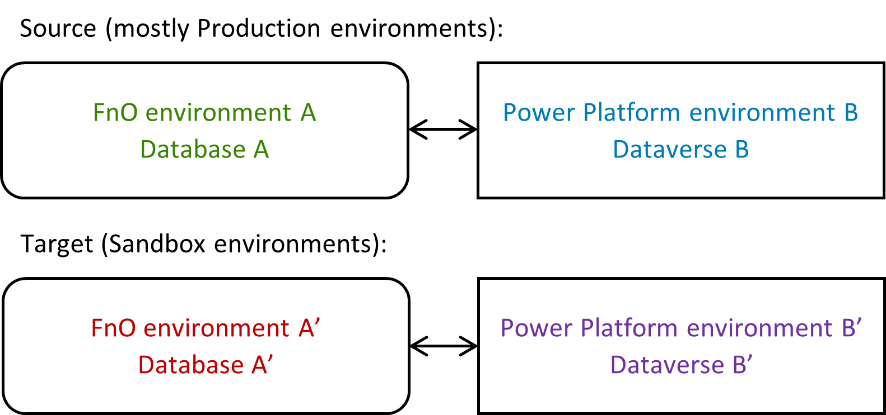
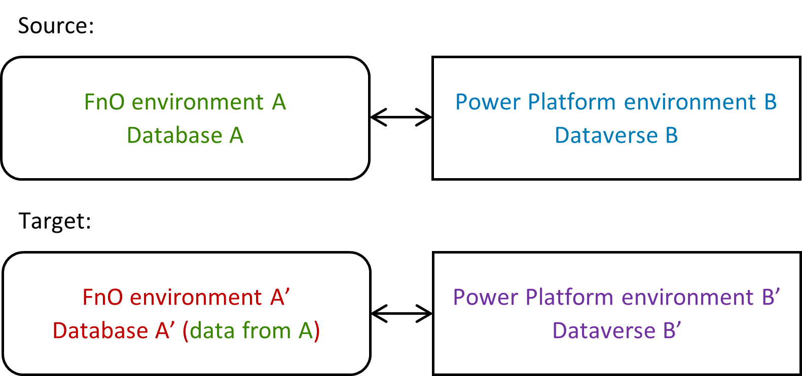
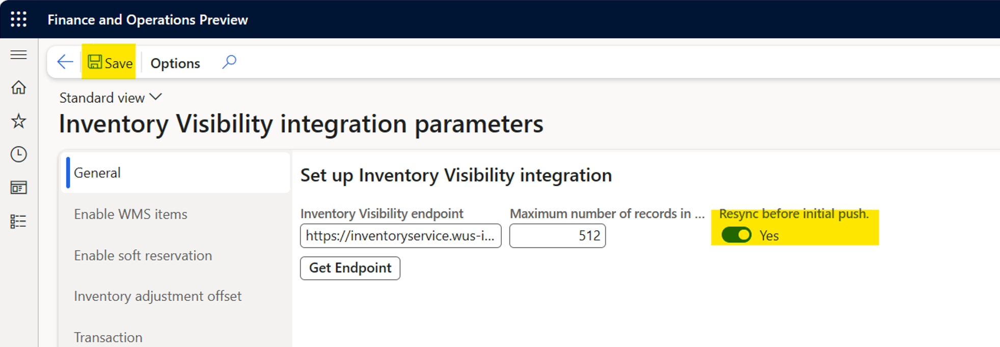
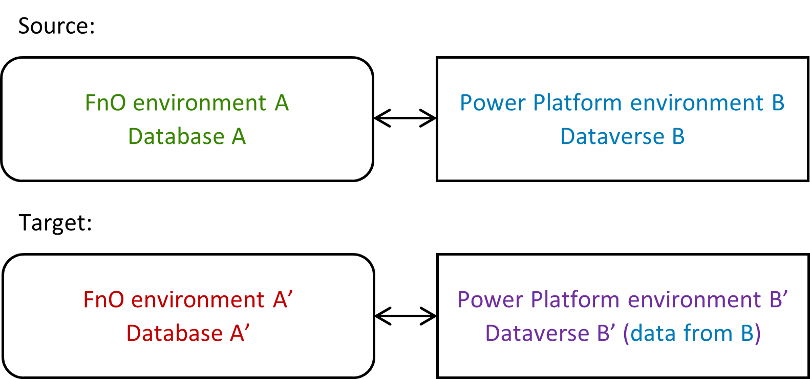
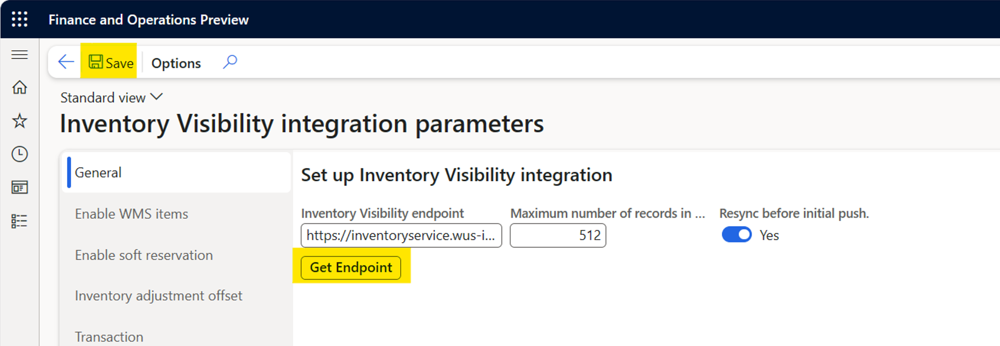
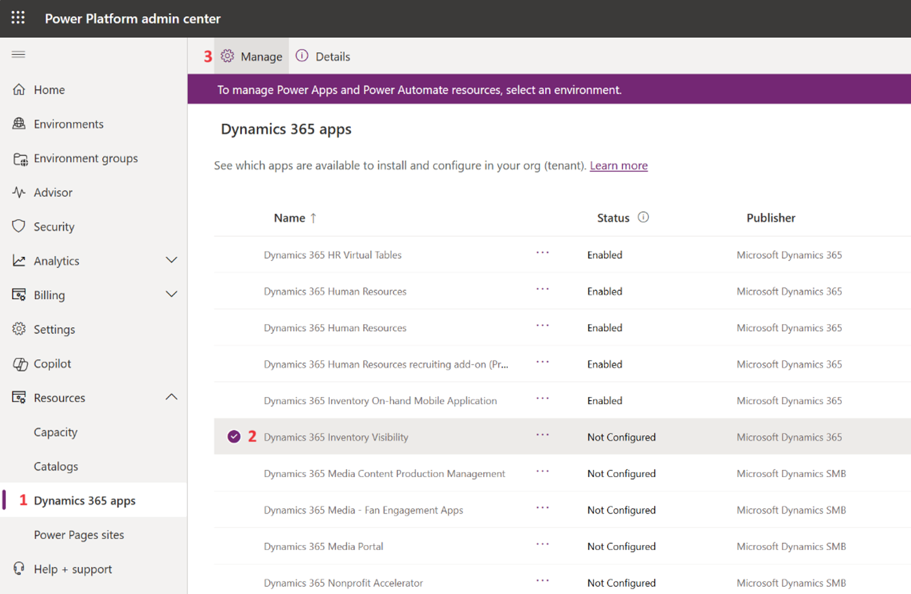
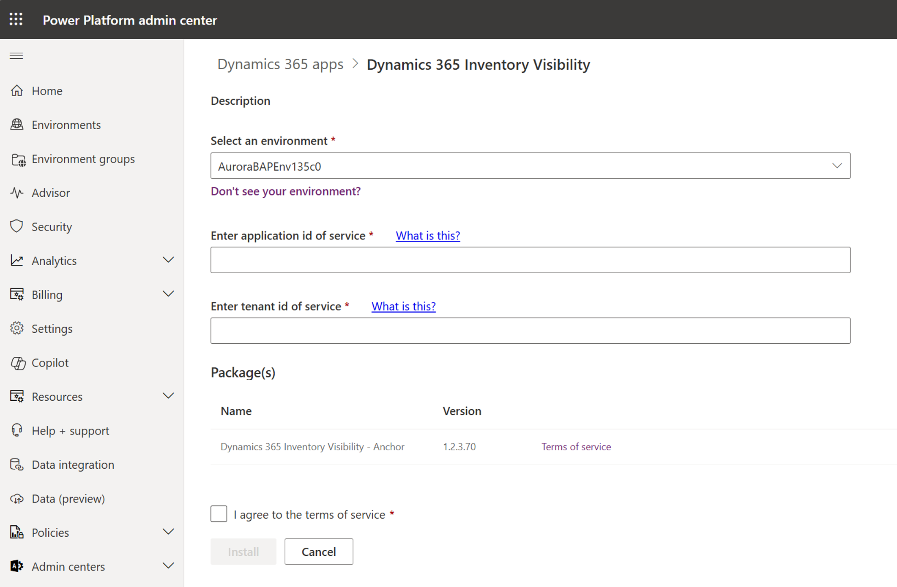

# Database and Dataverse Movement

This is an operating guide for Database and Dataverse movement. For scenarios that are not listed in this guide, please contact inventvisibilitysupp@microsoft.com for further support.

## Overview

For standard Inventory Visibility add-in users, a Dynamics 365 Finance and Operation (referred to as FnO) environment is linked to a Power Platform environment. Usually, for the purpose of testing, users may perform movement operation on Database in FnO environment or Dataverse in Power Platform environment. According to the operation type, detailed instructions are listed in the table below.

For IV users who also use IOM, additional attention is needed to make sure that IV installation is prior to IOM installation. For IOM users who only use integrated IV plugin inside IOM Power App, please contact IOM team for support.

Suppose that $\color{#388600}{\textsf{FnO environment A}}$ and $\color{#007BB8}{\textsf{Power Platform environment B}}$ are the pair of environments to start with (in many cases they are Production environments), self-service instructions are provided for the following operations. A [troubleshooting list](#troubleshooting) including common issues is also provided.

| Movement Operation |
| :-------: |
| [Only copy A to A’](#only-copy-fno-database-a-to-database-a) |
| [Only copy B to B’](#only-copy-power-platform-dataverse-b-to-dataverse-b) |
| [Copy A to A’ and copy B to B’](#copy-fno-database-a-to-database-a-and-copy-power-platform-dataverse-b-to-dataverse-b) |
| |

> [!IMPORTANT] 
> If the target environment ($\color{#C00000}{\textsf{A’}}$ and $\color{#7030A0}{\textsf{B’}}$) of your movement operation are Production environments, no matter which action you want to take, please contact inventvisibilitysupp@microsoft.com with your detailed scenario for further support.

## Only copy FnO Database A to Database A’

1. Follow Database guide to copy FnO $\color{#388600}{\textsf{Database A}}$ to $\color{#C00000}{\textsf{Database A’}}$.

2. In $\color{#C00000}{\textsf{FnO environment A’}}$, go to Inventory management -> Setup -> Inventory Visibility integration parameters. Enable Resync before initial push and save.

3. Go to Inventory management -> Periodic tasks -> Inventory Visibility integration, disable the job and then re-enable it. FnO data is synced to IV as the record count decreases.

## Only copy Power Platform Dataverse B to Dataverse B’

1. In target environment $\color{#C00000}{\textsf{A’}}$ and $\color{#7030A0}{\textsf{B’}}$, ensure that IV has been installed. This step is for the registration of target environment. ([What to do if you miss this step](#i-didnt-install-iv-before-i-copied-the-power-platform-environment))

2. Follow Dataverse guide to copy Power Platform $\color{#007BB8}{\textsf{Dataverse B}}$ to $\color{#7030A0}{\textsf{Dataverse B’}}$.

3. Follow [authentication through API](https://learn.microsoft.com/dynamics365/supply-chain/inventory/inventory-visibility-api#inventory-visibility-authentication) to obtain an access token.

4. Send the following API request with the above access token to refresh the environment id in IV configuration. You should receive 200 OK status for this API. Otherwise, please retry.

| | |
| -- | ---- |
| **Endpoint** | Endpoint of $\color{#C00000}{\textsf{environment A’}}$ ([What to do if you don’t have the endpoint](#i-dont-have-the-endpoint-of-target-environment-when-refreshing-the-environment-id-in-iv-configuration)) |
| **Path** | /api/environment/`{FnO_Environment_Id_A’}`/updateEnvIdInConfig |
| **Method** | Post |
| **Headers** | Api-Version=1.0   Authorization=Bearer `{access_token}`   Content-Type=application/json |
| **Query (Url Parameters)** | oldEnvironmentId=`{FnO_Environment_Id_A}` |
| | |

> [!IMPORTANT] 
> Please be careful about the two `FnO_Environment_Id` values. The one in **Path** is the environment id of $\color{#C00000}{\textsf{environment A’}}$. The one in **Query (Url Parameters)** is the environment id of $\color{#388600}{\textsf{environment A}}$.

5. In $\color{#7030A0}{\textsf{Power Platform environment B’}}$, go to IV Power App -> Admin Settings. Select [Update Configuration](https://learn.microsoft.com/dynamics365/supply-chain/inventory/inventory-visibility-power-platform#update-configuration) for the previous step to take effect.

6. Select [Show Service Details](https://learn.microsoft.com/dynamics365/supply-chain/inventory/inventory-visibility-power-platform#endpoint). You should find service endpoint and environment id of $\color{#C00000}{\textsf{environment A’}}$. If they still appear to be the values of $\color{#388600}{\textsf{environment A}}$, please refresh the page. From now on, please use this endpoint for $\color{#C00000}{\textsf{environment A’}}$ wherever IV is called.

7. Since IV data is implicitly integrated with environment id, the IV data in $\color{#7030A0}{\textsf{Dataverse B’}}$ now is useless. IV works fine with this data left in Dataverse, so if Dataverse capacity allows, you may skip this cleanup step.
    - How to cleanup: Ensure that IV batch job in $\color{#C00000}{\textsf{FnO environment A’}}$ is disabled and [Delete all inventory data](https://learn.microsoft.com/dynamics365/supply-chain/inventory/inventory-visibility-power-platform#delete-data). The delete job may take hours and once it starts, please retry until success. ([How to check the execution result of delete all inventory job?](#how-to-check-the-execution-result-of-delete-all-inventory-job))

8. In $\color{#C00000}{\textsf{FnO environment A’}}$, go to Inventory management -> Periodic tasks -> Inventory Visibility integration, disable the job and then re-enable it. FnO data is synced to IV as the record count decreases.

## Copy FnO Database A to Database A’ and copy Power Platform Dataverse B to Dataverse B’

1. In target environment $\color{#C00000}{\textsf{A’}}$ and $\color{#7030A0}{\textsf{B’}}$, ensure that IV has been installed. This step is for the registration of target environment. ([What to do if you miss this step](#i-didnt-install-iv-before-i-copied-the-power-platform-environment))

2. Follow Database guide to copy FnO $\color{#388600}{\textsf{Database A}}$ to $\color{#C00000}{\textsf{Database A’}}$, and follow Dataverse guide to copy Power Platform $\color{#007BB8}{\textsf{Dataverse B}}$ to $\color{#7030A0}{\textsf{Dataverse B’}}$.

3. Follow [authentication through API](https://learn.microsoft.com/dynamics365/supply-chain/inventory/inventory-visibility-api#inventory-visibility-authentication) to obtain an access token.

4. Send the following API request with the above access token to refresh the environment id in IV configuration. You should receive 200 OK status for this API. Otherwise, please retry.

| | |
| -- | ---- |
| **Endpoint** | Endpoint of $\color{#C00000}{\textsf{environment A’}}$ ([What to do if you don’t have the endpoint](#i-dont-have-the-endpoint-of-target-environment-when-refreshing-the-environment-id-in-iv-configuration)) |
| **Path** | /api/environment/`{FnO_Environment_Id_A’}`/updateEnvIdInConfig |
| **Method** | Post |
| **Headers** | Api-Version=1.0   Authorization=Bearer `{access_token}`   Content-Type=application/json |
| **Query (Url Parameters)** | oldEnvironmentId=`{FnO_Environment_Id_A}` |
| | |

> [!IMPORTANT] 
> Please be careful about the two `FnO_Environment_Id` values. The one in **Path** is the environment id of $\color{#C00000}{\textsf{environment A’}}$. The one in **Query (Url Parameters)** is the environment id of $\color{#388600}{\textsf{environment A}}$.

5. In $\color{#7030A0}{\textsf{Power Platform environment B’}}$, go to IV Power App -> Admin Settings. Select [Update Configuration](https://learn.microsoft.com/dynamics365/supply-chain/inventory/inventory-visibility-power-platform#update-configuration) for the previous step to take effect.

6. Select [Show Service Details](https://learn.microsoft.com/dynamics365/supply-chain/inventory/inventory-visibility-power-platform#endpoint). You should find service endpoint and environment id of $\color{#C00000}{\textsf{environment A’}}$. If they still appear to be the values of $\color{#388600}{\textsf{environment A}}$, please refresh the page. From now on, please use this endpoint for $\color{#C00000}{\textsf{environment A’}}$ wherever IV is called.

7. Since IV data is implicitly integrated with environment id, the IV data in $\color{#7030A0}{\textsf{Dataverse B’}}$ now is useless. IV works fine with this data left in Dataverse, so if Dataverse capacity allows, you may skip this cleanup step.
    - How to cleanup: Ensure that IV batch job in $\color{#C00000}{\textsf{FnO environment A’}}$ is disabled and [Delete all inventory data](https://learn.microsoft.com/dynamics365/supply-chain/inventory/inventory-visibility-power-platform#delete-data). The delete job may take hours and once it starts, please retry until success. ([How to check the execution result of delete all inventory job?](#how-to-check-the-execution-result-of-delete-all-inventory-job))

8. In $\color{#C00000}{\textsf{FnO environment A’}}$, go to Inventory management -> Setup -> Inventory Visibility integration parameters. Select Get Endpoint and save.

9. Go to Inventory management -> Periodic tasks -> Inventory Visibility integration, disable the job and then re-enable it. FnO data is synced to IV as the record count decreases.

## Troubleshooting

Toubleshooting list:

- [How to check the execution result of delete all inventory job?](#how-to-check-the-execution-result-of-delete-all-inventory-job)

- [I don’t see the option of Delete all inventory data.](#i-dont-see-the-option-of-delete-all-inventory-data)

- [I didn’t install IV before I copied the Power Platform environment.](#i-didnt-install-iv-before-i-copied-the-power-platform-environment)

- [I don’t have the endpoint of target environment when refreshing the environment id in IV configuration.](#i-dont-have-the-endpoint-of-target-environment-when-refreshing-the-environment-id-in-iv-configuration)

> [!NOTE] 
> **For further support, please contact us via InventVisibilitySupp@microsoft.com.**

### How to check the execution result of delete all inventory job?

While the delete job is executing, actions are blocked from IV Power App UI. After the job finishes, a success or failure message will pop out on top according to the execution result. If you missed the message, you may simply select again the Manage button of Delete all inventory data. If the previous job completed successfully and tables are clean, a success message will pop out immediately instead of the delete warning box (required solution version no older than 1.2.3.58).

### I don’t see the option of Delete all inventory data.

Please [update Inventory Visibility Add-in](https://learn.microsoft.com/dynamics365/supply-chain/inventory/inventory-visibility-setup#update-add-in) in your target environment.

### I didn’t install IV before I copied the Power Platform environment.

Without installation, the target environment is not registered to IV service, so you would encounter failures in the authentication step. For such cases, please follow the instructions according to your situation.

- if you are able to access LCS page of the target environment, you may [install IV from LCS](https://learn.microsoft.com/dynamics365/supply-chain/inventory/inventory-visibility-setup#install-the-inventory-visibility-add-in-from-lifecycle-services) with a new application (client) Id, and then you could proceed with the authentication step.

- If you are not able to access LCS page of the target environment (such as a UDE environment), please follow the below steps.
    1. [Register an application](https://learn.microsoft.com/entra/identity-platform/quickstart-register-app) and [add a client secret](https://learn.microsoft.com/entra/identity-platform/quickstart-register-app?tabs=certificate#add-credentials) to Microsoft Entra under your Azure subscription. Make a note of the **application (client) Id**, **client secret**, and **tenant Id** values.
    2. Go to Power Platform admin center.
    3. On the left panel, select Resources -> Dynamics 365 apps. Find Dynamics 365 Inventory Visibility in the app list and click Manage.
    
    4. Select the target environment. Enter the application Id and tenant Id that are registered from Azure portal. Agree to the terms of service and click Install.
    
    5. During installation, the status of IV add-in is shown as Installing. After installation completes, the status will change to Installed and you may proceed with the authentication step.

### I don’t have the endpoint of target environment when refreshing the environment id in IV configuration.

Disable the auto-redirection of your client and send the `updateEnvIdInConfig` request with the endpoint of your source environment.

- If the response status is 200, move on with the remaining steps.

- If the response status is 401, contact us via InventVisibilitySupp@microsoft.com. Include the environment ID of your target environment in the email.

- If the response status is 308 (Permanent Redirect), the endpoint of your target environment can be found in the `Location` field of the response headers. Note that query parameter (oldEnvironmentId) may not be captured in this field. Next, re-send the request with the endpoint of your target environment and the correct query parameter. After receiving a 200 response status, you can move on with the remaining steps.
